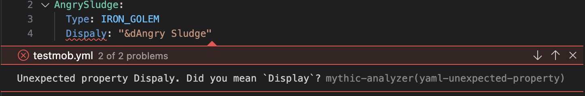
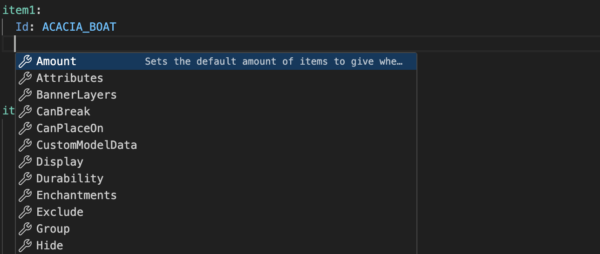
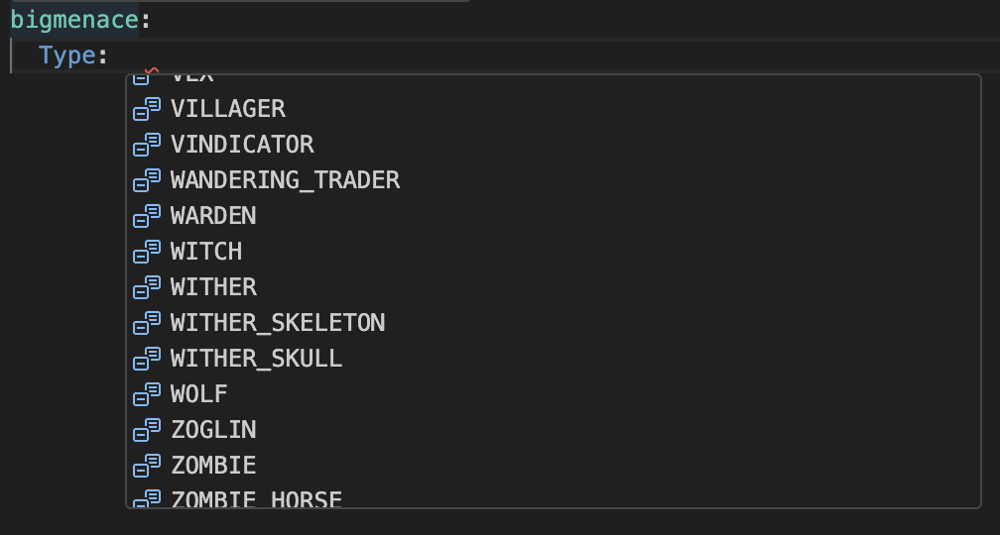

<div align="center">


# Mythic Analyzer

</div>

<p align="center">MythicMobs configuration analysis</p>

<div align="center">
    <a href="https://discord.gg/SHthmb6t6n">
        
    </a>
    <a href="https://github.com/0tickpulse/mythic-analyzer/blob/main/LICENSE">
        
    </a>
    <!-- Marketplace link -->
    <a href="https://marketplace.visualstudio.com/items?itemName=0tickpulse.mythic-analyzer-vsc">
        
    </a>
</div>

---

## 📖 Table of Contents

- [Mythic Analyzer](#mythic-analyzer)
  - [📖 Table of Contents](#-table-of-contents)
  - [🚀 Features](#-features)
    - [🎉 Current](#-current)
      - [YAML Validation](#yaml-validation)
      - [Simple Autocompletion](#simple-autocompletion)
      - [NPM Package/API](#npm-packageapi)
  - [⚠️ Limitations](#️-limitations)
  - [📝 License](#-license)
  - [❤️ Credits and Acknowledgements](#️-credits-and-acknowledgements)

## 🚀 Features

**Currently, these features are available on:**

- MythicMob Mob files
- MythicMob Item files
- MythicMob Skill files

### 🎉 Current

#### YAML Validation

The extension provides YAML validation for MythicMobs configurations.
This makes it easier to spot typos and other mistakes in your configuration files.



#### Simple Autocompletion

The extension provides simple autocompletion for things like keys and enum values.




#### NPM Package/API

The extension is also available as an NPM package, which can be found [here](https://www.npmjs.com/package/mythic-analyzer).

```bash
pnpm install mythic-analyzer
```

The package exposes an API and can be used to create custom tools that require MythicMobs configuration analysis.

## ⚠️ Limitations

The extension is still in beta and may have bugs. Here are some known limitations:

- The extension does not support YAML anchors and aliases.
- The extension does support Mythic submapping, where a key can be written like `A.B.C` instead of `A: { B: { C: ... } }`. However, this is quite buggy and may not work as expected.

## 📝 License

This project is licensed under AGPLv3. A copy can be found [here](./LICENSE).

## ❤️ Credits and Acknowledgements

- Microsoft and the VSCode team, for providing the [Language Server Protocol](https://microsoft.github.io/language-server-protocol/), [VSCode Extension API](https://code.visualstudio.com/api), [YAML tmLanguage](https://code.visualstudio.com/api/language-extensions/syntax-highlight-guide), and more.
- [MythicMobs](https://www.mythicmobs.net/) and [its community](http://www.mythicmobs.net/discord), for creating and maintaining the plugin and its documentation.
- Every contributor on my discord server, for helping me with testing and providing feedback.
