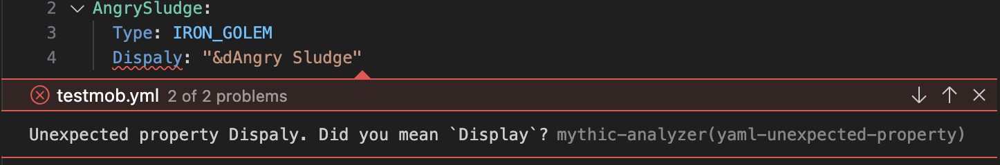
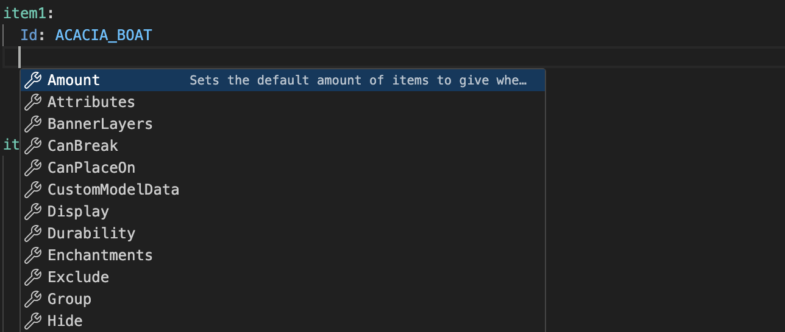
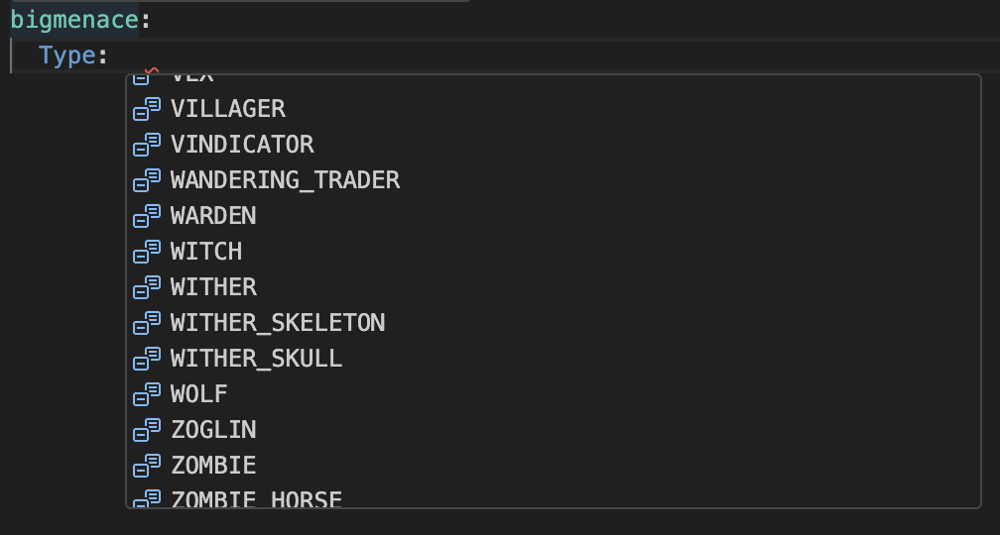

<h1> Mythic Analyzer</h1>

    
    

A Visual Studio Code extension that adds language support for MythicMobs configurations.

## 📖 Table of Contents

- [📖 Table of Contents](#-table-of-contents)
- [🚀 Features](#-features)
  - [🎉 Current](#-current)
    - [YAML Validation](#yaml-validation)
    - [Simple Autocompletion](#simple-autocompletion)
- [📝 License](#-license)
- [❤️ Credits and Acknowledgements](#️-credits-and-acknowledgements)

## 🚀 Features

**Currently, these features are available on:**

- MythicMob Mob files
- MythicMob Item files
- MythicMob Skill files

### 🎉 Current

#### YAML Validation

The extension provides YAML validation for MythicMobs configurations.
This makes it easier to spot typos and other mistakes in your configuration files.

#### Simple Autocompletion

The extension provides simple autocompletion for things like keys and enum values.

## 📝 License

This project is licensed under AGPLv3. A copy can be found [here](./LICENSE).

## ❤️ Credits and Acknowledgements

- Microsoft and the VSCode team, for providing the [Language Server Protocol](https://microsoft.github.io/language-server-protocol/), [VSCode Extension API](https://code.visualstudio.com/api), [YAML tmLanguage](https://code.visualstudio.com/api/language-extensions/syntax-highlight-guide), and more.
- [MythicMobs](https://www.mythicmobs.net/) and [its community](http://www.mythicmobs.net/discord), for creating and maintaining the plugin and its documentation.
- Every contributor on my discord server, for helping me with testing and providing feedback.
